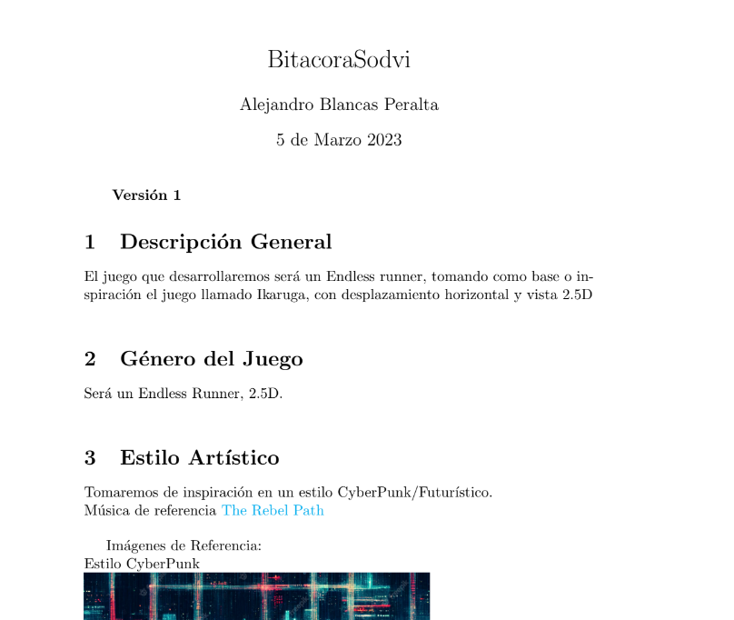
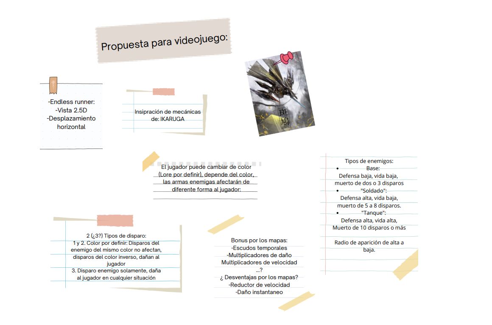
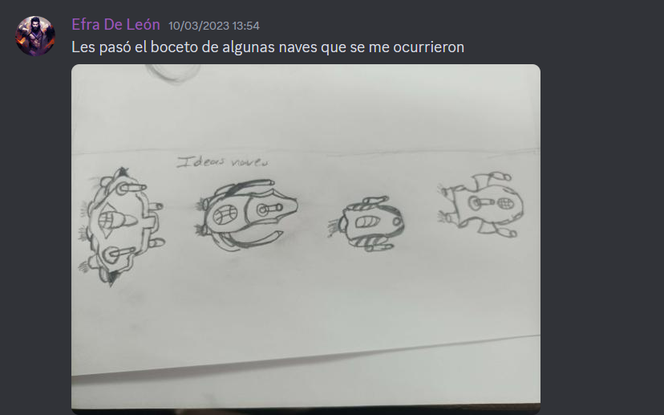
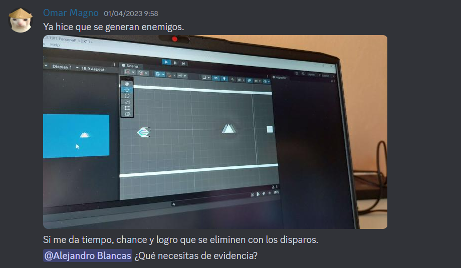
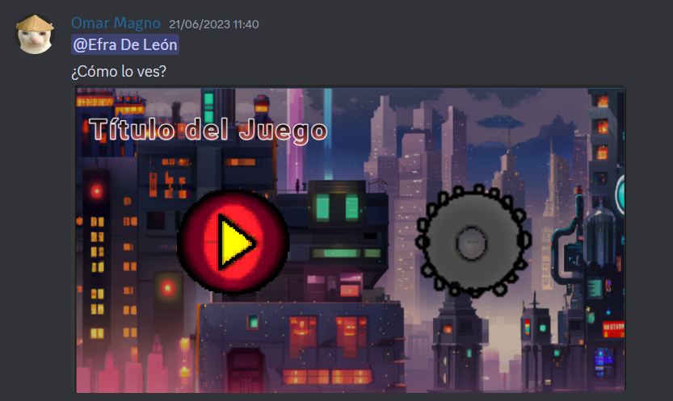
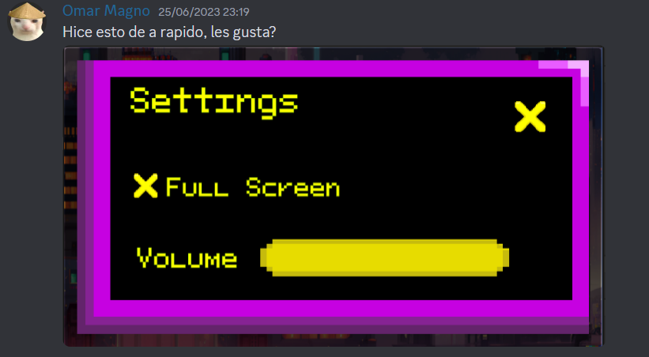
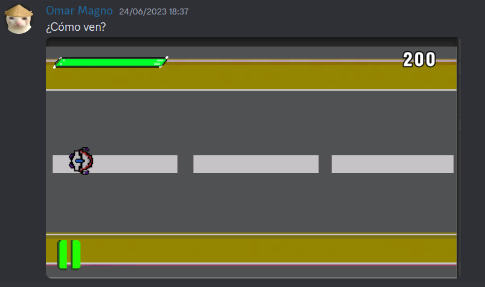

# CircuitRunners
Juego de nivel 1 de SODVI, hecho por Omar Magno, Efra de León y Liliana Mendoza

Integrantes:

## Magno García Omar - Coder

## De León Vargas Efra Nathaniel - Artista

Semestre: 2024-1

Torre de niveles:  Nivel 1

# Introducción:

El obvjetivo de este proyecto es crear un juego de acción en 2.5D *Endless Runner* de la mano del aprendijaze de diferentes herramientas, 
del uso de motores gráficos  como *Unity* y el aprendizaje de diseño y composición de personajes y musicalización para entregar un juego 
entretenido y frenético.

# Descripción del proyecto:

Tomamos como inspiración el juego *Ikaruga* debdio al estiulo artísitico y sus mecánicas frenéticas, en la priemra reunión conformamos entre todos que el estilo
del juego, así como su dirección artística sería fuertemente inspriada del subgénero *Cyberpunk* 

Al principio se pensó usar estilo *HD*, pero debido a la falta de compromiso de algunos integrantos, se optó por usar pixel art, manteniendo el estilo cyberpunk, 
pero trasladado al alrte *Pixel Art*.
De la mano del artista, se creó una nave futurista como personaje jugable además de crear enemigos como coches de policía, autos blindados, entre otros.
Con respecto a las mecánicas, optamos por acción veritcal, los enemigos irián contra el jugador del lado izquierdo de la pantalla, se tuvo en mente agregar
*Power Ups* pero a falta de tiempo de desechó la idea.

Para el puntaje, el coder agregó uncontador que marca el tiempo con vida que tiene el jugardor, el objetivo del juego es sobrevivir la mayor el mayor tiempo
posible frente a los obstaculos que se presenten.
Conforme el proyecto avanzaba, el coder armó un esqueleto del juego para probar las mecánicas que se implementarían al juego, de esta forma logramos
identificar cuáles mecánicas ayudarían a tener un juego más freneético, y cuales otras, por el contrario, serían perjudiciales al *gameplay*.

Por medio de Discord, se fueron subiendo los avances, los integrantes que sobraron subían sus progresos para ser compartidos y escuchar las diferentes opiniones
de los demás integrantes.

Se realizaron pruebas de música y sonido para el videojuego

Debido a la desaparición de algunos de los integrantas, se trabajó a marchas forzadas, en algunos momentos el coder tenía que realizar el diseño de los menús y 
agrupar todo, sin embargo en mensaje se acordaron la mayoría de las decisiones del trabajo.

Pese a las bajas que tuvimos en el equipo, logramos sacar el juego adelante, tristemente algunas mecánicas que queríamos implementar, pero por falta de tiempo
no se lograron (Como personajes seleccionables, mayor fluidez, agregar más animaciones, etc), pese a esto, se consiguió tener un *gameplay* divertido, con una 
dificultad descente, en el proceso si, hubo bastanres cambios respecto a las idea original, pero consideramos entre todos que respetamos la escencia origial del
juego.  

# Conclusión:

Coder: Como programador de este proyecto, debo decir que fue un reto de bastante altura, siendo alguien que tuvo nulo contacto con un motor como es *Unity* tener
que programar moviemiento de personajes, agregar menús, ademas de una falta grave de comunicación debido a que el manager dejó el proyecto.
Sin embargo, debo reconocer que el resultado final fue agradable para mi, ver que las lineas de código que escribí sirivieron para sacar este proyecto
adelante es muestra suficiente de uno puede aspoirar a más. Obviamente hay mucho que mejorar en este primer proyecto, pero siento que gracias a este, 
aprendí muchos conceptos sobre *Unity*, lo cual me ayuda a tener buenas bases para los próximos proyectos que se avecinan.

Artista: Para resumirlo lo que sea logrado con la creación de nuestro videojuego, fue un proyecto bastante bien estructurado para ir diseñándolo,  a pesar de las 
dificultades se logro completar con los requisitos solicitados y también fue bastante entretenido ir diseñando y saber en que iban a ir esos diseños y ver como 
progresaba tanto así que aprendí a saber un mejor uso para el pixel art y aprender a usar IA para diseños que posiblemente quedarían haciendo, también a pesar de 
unas dificultades logre enteder y prepararme para que quedara el proyecto bien y finalizado.

Musico: Para este primer videojuego, me ausente en gran parte del proceso, sin embargo pude retomar el proyecto aprendiendo un nuevo software para la edición, creación y composición de sonido y música FL studio, por el cual seguí el estilo del videojuego cyberpunk y 8 bits. 
El coder y artista crearon un buen primer videojuego con los requerimientos del primer nivel, aprecio su forma de trabajar y que me permitieran retomar el proyecto.
